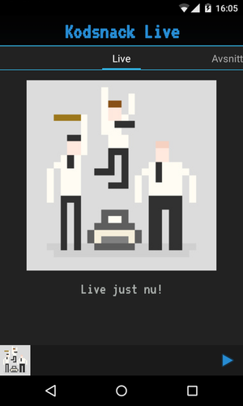

# Kodsnack för Android

En enkel Android-app för att strömma Kodsnacks livesändningar.

Kräver följande behörigheter:

* INTERNET: Föra att kunna komma åt liveströmmen.
* WAKE_LOCK: För att förhindra att telefonen går ner i viloläge under
  tiden man strömmar.

## Licens
Koden är under en 2-klausuls BSD-licens. Undantaget är följande:

* app/libs/volley.jar (Apache 2.0)
* app/src/main/assets/fonts/vt323.ttf (av Peter Hull, SIL Open Font License, 1.1)
* app/src/main/res/drawable\*/kodsnack\*.png (av [Kristoffer Grönlund](https://github.com/krig))
* app/src/main/res/drawable\*/appsnack\*.png (av [Appsnack](http://appsnack.se))

## Medverkande
[Erik Jansson](http://github.com/Meldanya)

## Att Göra
Saker att göra finns som issues här på GitHub. Om du kommer på något som
saknas eller hittar en bugg, lägg gärna till ett nytt issue! Om du vill
koda på appen, hitta ett issue (eller skapa ett med din idé) och börja
hacka!

